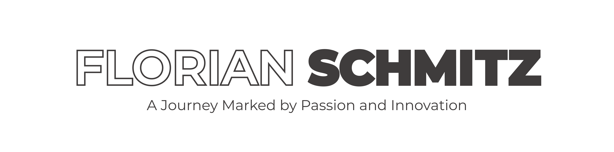

## About Me

Hello, I'm Florian Schmitz, an ambitious, creative, and energetic software developer with a passion for Flutter and innovative technologies. My journey in software development is marked by passion, self-fulfillment, success, and enthusiasm.

I work as a **Flutter Engineer** at **[coodoo GmbH](https://coodoo.de/)**, a leading Flutter agency. Throughout my career, I have taken on roles such as team lead and software architect for various projects. Together with my friend Richard Maasri, I am in the process of founding a successful software company called **[CodeNature](https://github.com/CodeNatureHQ)**.

## Vision

My long-term goals are to develop software and apps for both B2B and B2C sectors that everyone knows and uses. I aspire to be recognized as a successful entrepreneur and innovator who shares his passion and drives innovation.

## Projects

Here are some of my recent projects:

- **[Global B2B Wholesale Shop](https://www.linkedin.com/in/florian-schmitz-de/details/projects/)**:\
  I served as the Software Architect for a global conglomerate's B2B wholesale shop at coodoo GmbH, guiding the client's development team to ensure adaptive and responsive design across Android, iOS, and web platforms.
- **[Management App for Fencing and Gates Industry](https://www.linkedin.com/in/florian-schmitz-de/details/projects/)**:\
  My team and I at coodoo GmbH developed a management app for a leading fencing and gates company, featuring offline capabilities, work timers, material tracking, and project documentation using Flutter to enhance construction site efficiency.
- **[BeaConX Web App With Showcase App](https://www.linkedin.com/in/florian-schmitz-de/details/projects/)**:\
  For my graduation project, I developed BeaConX, a BLE beacon-based proximity marketing tool with a Flutter frontend and Supabase backend, enhancing customer interaction and providing business insights.

## Collaboration with Richard Maasri

Together with my friend Richard Maasri, who shares similar goals, I am in the process of founding **[CodeNature](https://github.com/CodeNatureHQ)**. We are working together to develop innovative software solutions and share our knowledge. Learn more about Richard on his GitHub profile: [Richard Maasri](https://github.com/dasKamael).

## References and Training

We at **[coodoo GmbH](https://coodoo.de/)** offer Flutter training through the **Flutter™ Akademie** at [Flutter Germany](https://flutter.de). Visit the website to learn more about our training offerings.

## Contact

- **LinkedIn**:  [@florian-schmitz-de](https://www.linkedin.com/in/florian-schmitz-de/)
- **X**:         [@_florianschmitz](https://x.com/_florianschmitz)
- **Instagram**: [@_florianschmitz](https://www.instagram.com/_florianschmitz/)
- **Email**:     [contact@codenature.dev](mailto:contact@codenature.dev)

---

> "With passion to innovation."

Thank you for visiting my GitHub profile. I look forward to exciting projects and collaborations!
